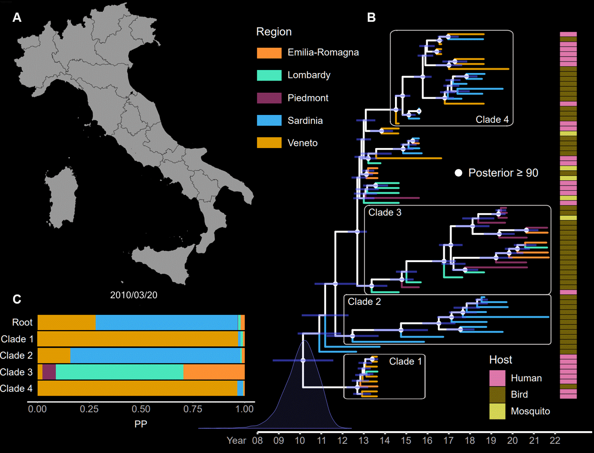

# WNV-L2_IT
Data, scripts and figures for analysing the evolutionary history of WNV L2 in Italy (last data: 01/03/2022)

You can find the complete details of the analysis in the paper "[Epidemiological and Evolutionary Analysis of West Nile Virus Lineage 2 in Italy](https://www.mdpi.com/1999-4915/15/1/35)".

